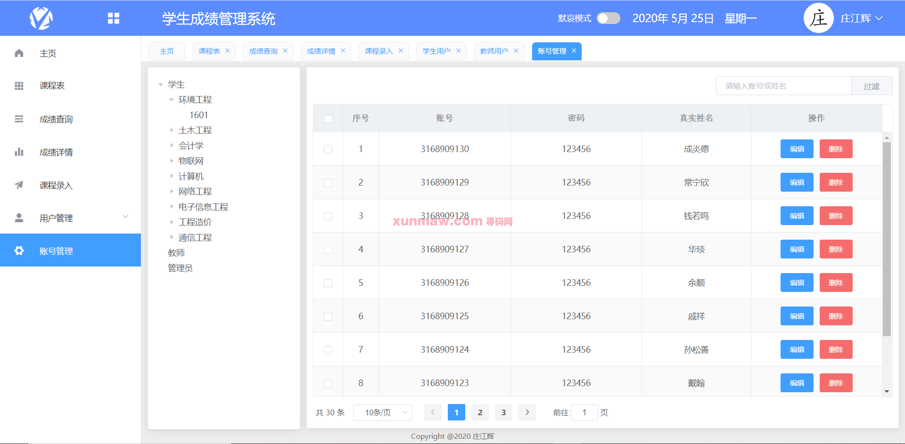
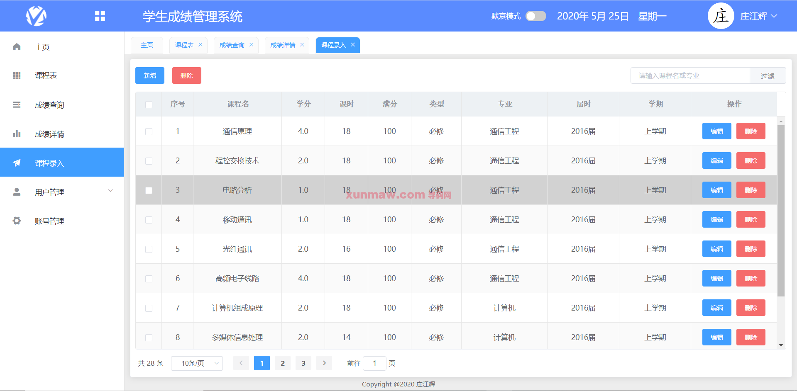
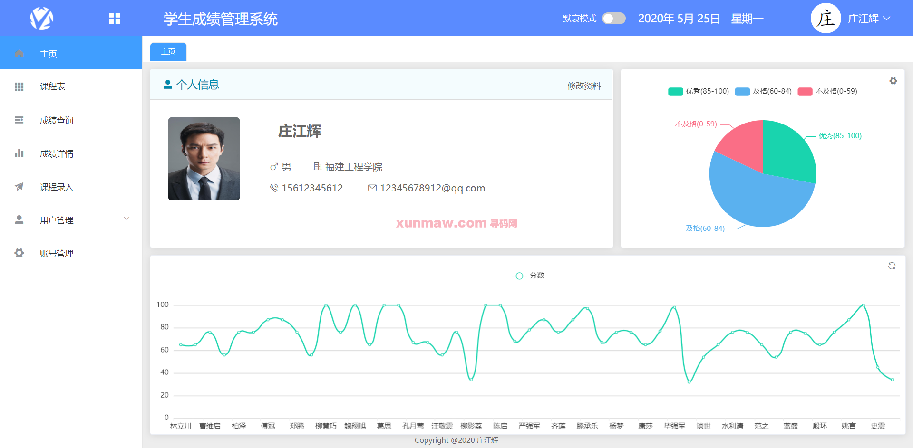
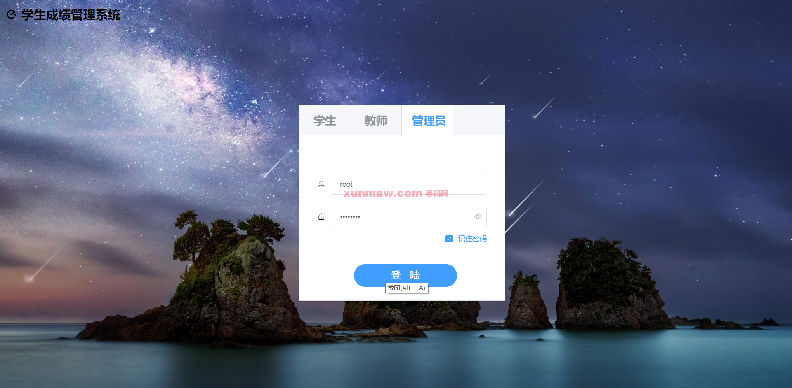
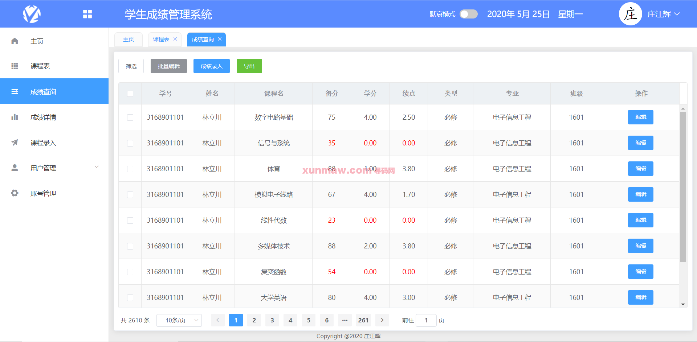
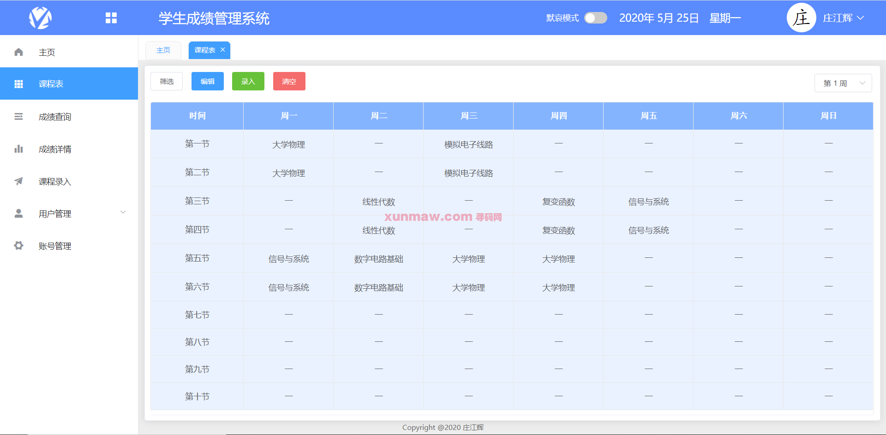
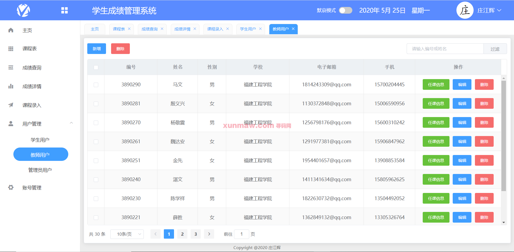

# 学生成绩管理系统

#### 介绍
基于springboot+vue实现的学生成绩管理系统，包含学生端与管理端，功能满足计算机专业毕业设计，使用技术钻也是现在比较活热的springboot+vue。

#### 软件架构
后端架构：springboot | myabtis  
前端架构：vue    
系统环境：jdk1.8 | maven | mysql   

#### 功能介绍

##### 【功能详述】 
1. 学生端部分功能截图：  
  
  
  
  

2. 管理端部分功能截图:    
  
  
  
  

#### 项目预览
地址：[商品详情 ](https://www.xunmaw.com/shop/detail/1632751018073473025)     
点击商品详情中的演示地址，看查看系统录制的视频    

#### 使用说明
1. 创建数据库，执行数据库脚本
2. 修改jdbc数据库连接参数
3. 下载安装maven依赖jar
4. 启动springboot项目（后端）

前端：
    cd ./forum-java-main/forum-app目录
    安装依赖: npm install  
    运行项目：npm run build

  请求地址：    
    http://localhost:8080/sms/     
    admin    
    123456  
     

#### 联系作者
获取源码 联系微信：xunmaw001
